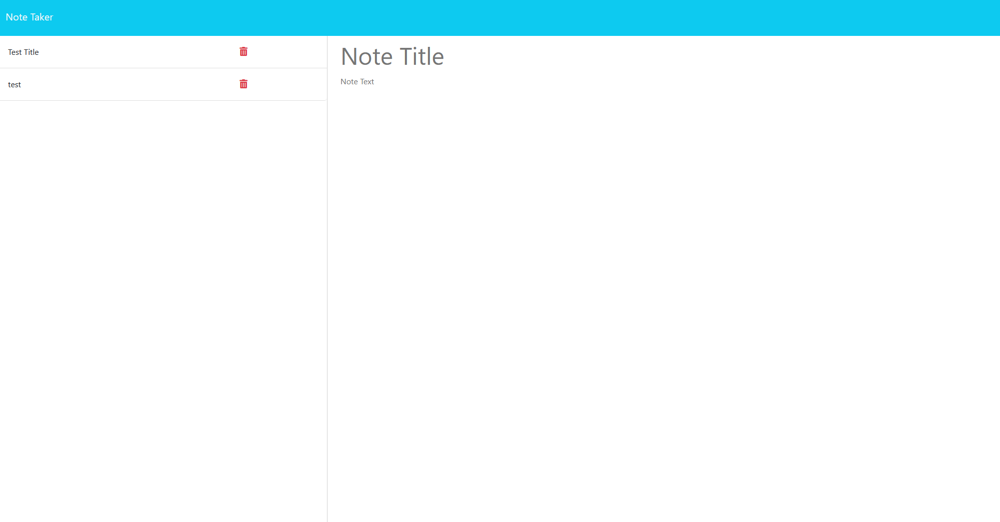

# Note Taker Starter Code

## Description
We were tasked to make a note taker application, making the backend using node.js. It allows you to create a note, save it on the server and interact with the server information.

## Screenshot 

## Site Link
https://homework-11-note-taker-d7bd7daf4c38.herokuapp.com/

## Credits
Worked with tutor to help finish the delete function, and worked with my wife Kayla Freeman